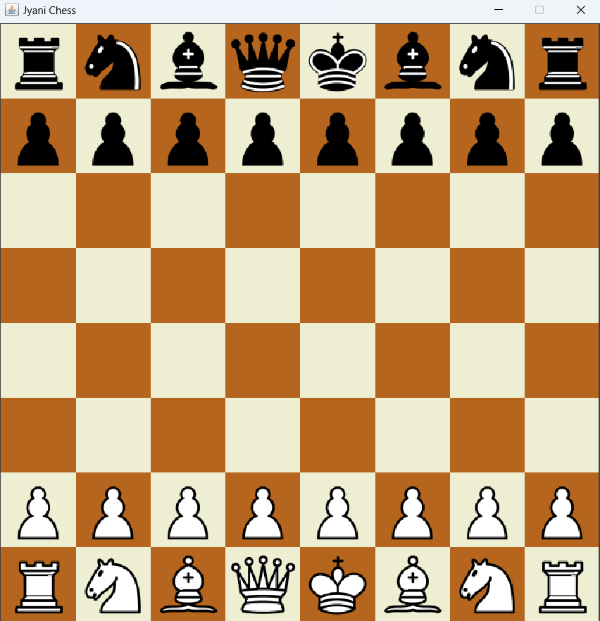
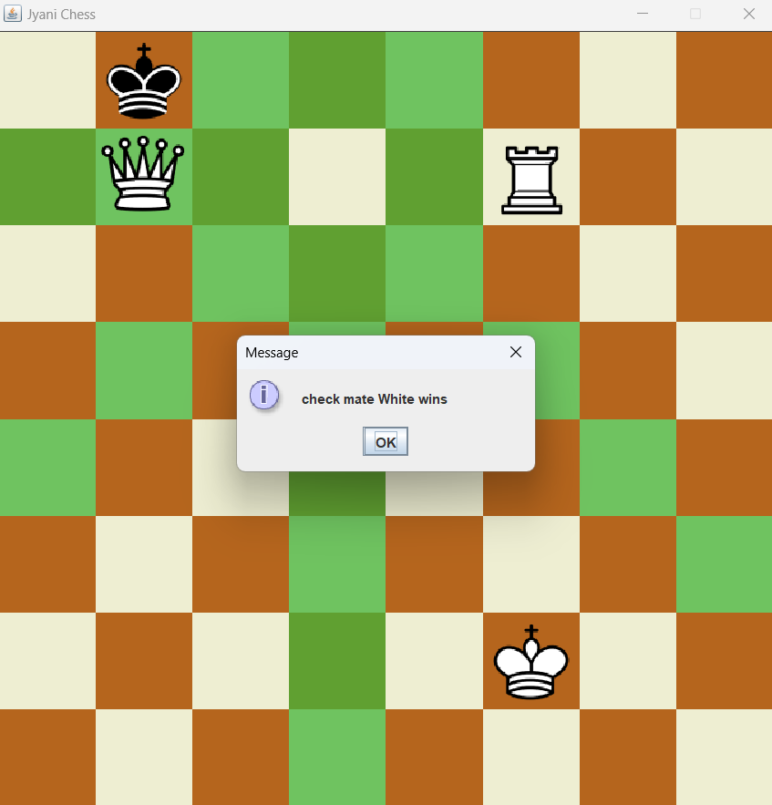
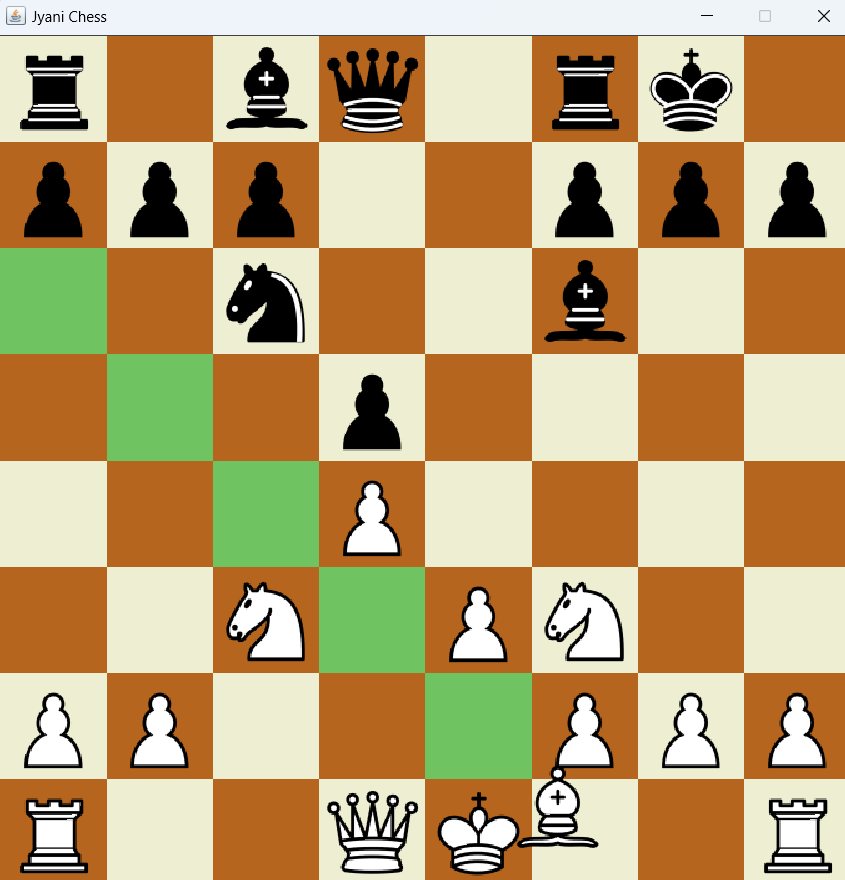

# Chessy

This is a Chess game built in Java using the Swing library. The game is designed with object-oriented programming (OOP) principles, providing a rich and interactive user experience. Whether you're a beginner or an experienced player, this game offers a complete and challenging chess environment.

## Features

- Complete Chess Gameplay: Play a full game of chess with all standard rules implemented.
- En Passant: Special pawn capturing move is fully supported.
- Check and Checkmate Detection: The game accurately detects when a player is in check or checkmate.
- Stalemate Detection: The game recognizes stalemates and handles them accordingly.
- Available Moves Highlighting: When a piece is selected, all available legal moves are highlighted on the board.
- User-Friendly Interface: Intuitive and responsive interface built using Java Swing.

## Preview

   

   

   


## Getting Started

### Prerequisites

- Java Development Kit (JDK): Ensure you have JDK 8 or later installed.
- IDE: While you can run the game from the command line, using an IDE like IntelliJ IDEA or Eclipse can enhance your development experience.

### Installation

1. Clone the Repository:
    ```
    git clone https://github.com/yashwardhan-jyani/Chessy.git
    ```

2. Navigate to the Project Directory:
    ```
    cd Chessy
    ```

3. Compile the Project:
    ```
    javac -d bin src/main/*.java src/pieces/*.java
    ```

4. Copy the Resources:
    ```
    xcopy src\res bin\res
    ```

5. Run the Game:
    ```
    java -cp bin main.Main
    ```